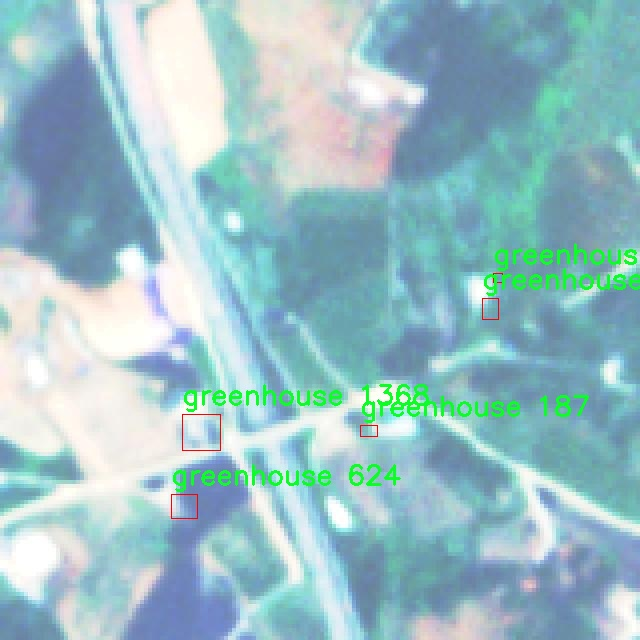

# 航拍温室大棚检测检测系统源码分享
 # [一条龙教学YOLOV8标注好的数据集一键训练_70+全套改进创新点发刊_Web前端展示]

### 1.研究背景与意义

项目参考[AAAI Association for the Advancement of Artificial Intelligence](https://gitee.com/qunmasj/projects)

项目来源[AACV Association for the Advancement of Computer Vision](https://kdocs.cn/l/cszuIiCKVNis)

研究背景与意义

随着全球人口的不断增长和城市化进程的加快，农业生产面临着前所未有的挑战。温室大棚作为现代农业的重要组成部分，能够有效提高作物的产量和质量，同时也为农作物的生长提供了更为稳定的环境。然而，温室大棚的管理与监测却是一项复杂而繁重的任务，传统的人工巡检方式不仅效率低下，而且容易受到人为因素的影响，难以实现实时监控和数据分析。因此，开发一种高效、准确的温室大棚检测系统显得尤为重要。

近年来，计算机视觉技术的快速发展为农业监测提供了新的解决方案。尤其是基于深度学习的目标检测算法，如YOLO（You Only Look Once）系列，因其在实时性和准确性方面的优越表现，已被广泛应用于各种物体检测任务。YOLOv8作为该系列的最新版本，结合了多种先进的技术和优化策略，具备了更强的特征提取能力和更快的推理速度，为温室大棚的智能监测提供了新的可能性。

本研究旨在基于改进的YOLOv8算法，构建一个高效的航拍温室大棚检测系统。通过对航拍图像的实时分析与处理，系统能够自动识别和定位温室大棚的位置，进而为农业管理者提供精准的数据支持。我们使用的数据集包含3800张标注图像，专注于温室大棚这一特定类别，这为模型的训练和测试提供了丰富的样本基础。通过对该数据集的深入分析与处理，我们可以更好地理解温室大棚在不同环境条件下的表现，从而提升模型的泛化能力和鲁棒性。

本研究的意义不仅在于提升温室大棚的检测效率，更在于推动智能农业的发展。通过引入先进的计算机视觉技术，我们可以实现对温室大棚的实时监控与管理，帮助农民及时发现潜在问题，优化资源配置，提高农业生产的整体效率。此外，随着数据的积累与分析，系统还可以为农业决策提供科学依据，促进可持续发展。

综上所述，基于改进YOLOv8的航拍温室大棚检测系统的研究，不仅具有重要的理论价值，也具备广泛的应用前景。它将为农业生产提供新的技术手段，推动农业现代化进程，助力实现更高效、更智能的农业管理模式。在全球农业面临挑战的背景下，该研究的开展无疑将为提升农业生产力、保障粮食安全贡献一份力量。

### 2.图片演示


##### 注意：由于此博客编辑较早，上面“2.图片演示”和“3.视频演示”展示的系统图片或者视频可能为老版本，新版本在老版本的基础上升级如下：（实际效果以升级的新版本为准）

  （1）适配了YOLOV8的“目标检测”模型和“实例分割”模型，通过加载相应的权重（.pt）文件即可自适应加载模型。

  （2）支持“图片识别”、“视频识别”、“摄像头实时识别”三种识别模式。

  （3）支持“图片识别”、“视频识别”、“摄像头实时识别”三种识别结果保存导出，解决手动导出（容易卡顿出现爆内存）存在的问题，识别完自动保存结果并导出到tempDir中。

  （4）支持Web前端系统中的标题、背景图等自定义修改，后面提供修改教程。

  另外本项目提供训练的数据集和训练教程,暂不提供权重文件（best.pt）,需要您按照教程进行训练后实现图片演示和Web前端界面演示的效果。

### 3.视频演示

[3.1 视频演示](https://www.bilibili.com/video/BV11gsaeXEX6/)

### 4.数据集信息展示

##### 4.1 本项目数据集详细数据（类别数＆类别名）

nc: 1
names: ['greenhouse']


##### 4.2 本项目数据集信息介绍

数据集信息展示

在本研究中，我们采用了名为“size160”的数据集，以支持对航拍温室大棚检测系统的改进，特别是针对YOLOv8模型的训练和优化。该数据集专门设计用于识别和定位温室大棚的特征，提供了一个高效的基础，以提高模型在实际应用中的准确性和鲁棒性。

“size160”数据集的构建考虑到了航拍图像的独特性，包含了大量来自不同地理位置和气候条件下的温室大棚图像。这些图像的分辨率和质量经过精心挑选，以确保在训练过程中能够充分提取出温室大棚的特征信息。数据集中包含的图像不仅涵盖了不同形状和尺寸的温室大棚，还考虑了光照、阴影和天气变化等因素，旨在模拟真实世界中的复杂场景。这种多样性为模型的泛化能力提供了坚实的基础，使其能够在各种环境下保持良好的检测性能。

该数据集的类别数量为1，专注于“greenhouse”这一特定类别。这种单一类别的设计使得模型在训练过程中能够更加专注于温室大棚的特征提取，避免了多类别检测时可能出现的混淆和干扰。通过集中训练，YOLOv8模型能够更深入地学习到温室大棚的独特特征，包括其边缘、轮廓以及与周围环境的对比，从而提升检测的准确性和效率。

在数据集的标注过程中，采用了精确的边界框标注技术，确保每个温室大棚的位置信息清晰可辨。这些标注不仅包括了温室大棚的外部轮廓，还考虑了不同视角下的变化，确保模型能够适应多种航拍角度。这种细致的标注方式为后续的模型训练提供了可靠的数据支持，使得YOLOv8在处理复杂场景时能够更好地识别和定位目标。

此外，为了进一步增强数据集的实用性，我们还进行了数据增强处理，包括旋转、缩放、翻转和颜色调整等。这些增强手段不仅丰富了数据集的多样性，还有效提高了模型的鲁棒性，使其能够在不同的环境条件下保持稳定的性能。通过这种方式，模型能够更好地应对实际应用中可能遇到的各种挑战，如光照变化、物体遮挡等。

总之，“size160”数据集为改进YOLOv8的航拍温室大棚检测系统提供了坚实的基础。通过高质量的图像、多样化的场景和精确的标注，该数据集不仅有助于提升模型的检测精度，还为后续的研究和应用提供了宝贵的数据支持。随着模型的不断优化和迭代，我们期待在温室大棚的自动检测和监测领域取得更大的突破，推动农业智能化的发展。




### 5.全套项目环境部署视频教程（零基础手把手教学）

[5.1 环境部署教程链接（零基础手把手教学）](https://www.ixigua.com/7404473917358506534?logTag=c807d0cbc21c0ef59de5)


[5.2 安装Python虚拟环境创建和依赖库安装视频教程链接（零基础手把手教学）](https://www.ixigua.com/7404474678003106304?logTag=1f1041108cd1f708b01a)

### 6.手把手YOLOV8训练视频教程（零基础小白有手就能学会）

[6.1 手把手YOLOV8训练视频教程（零基础小白有手就能学会）](https://www.ixigua.com/7404477157818401292?logTag=d31a2dfd1983c9668658)

### 7.70+种全套YOLOV8创新点代码加载调参视频教程（一键加载写好的改进模型的配置文件）

[7.1 70+种全套YOLOV8创新点代码加载调参视频教程（一键加载写好的改进模型的配置文件）](https://www.ixigua.com/7404478314661806627?logTag=29066f8288e3f4eea3a4)

### 8.70+种全套YOLOV8创新点原理讲解（非科班也可以轻松写刊发刊，V10版本正在科研待更新）

由于篇幅限制，每个创新点的具体原理讲解就不一一展开，具体见下列网址中的创新点对应子项目的技术原理博客网址【Blog】：


[8.1 70+种全套YOLOV8创新点原理讲解链接](https://gitee.com/qunmasj/good)

### 9.系统功能展示（检测对象为举例，实际内容以本项目数据集为准）

图9.1.系统支持检测结果表格显示

  图9.2.系统支持置信度和IOU阈值手动调节

  图9.3.系统支持自定义加载权重文件best.pt(需要你通过步骤5中训练获得)

  图9.4.系统支持摄像头实时识别

  图9.5.系统支持图片识别

  图9.6.系统支持视频识别

  图9.7.系统支持识别结果文件自动保存

  图9.8.系统支持Excel导出检测结果数据


### 10.原始YOLOV8算法原理

原始YOLOv8算法原理

YOLOv8是目标检测领域的最新进展，代表了YOLO系列模型在技术和应用上的一次重要飞跃。作为一款高效的目标检测模型，YOLOv8不仅继承了前几代YOLO模型的优点，还在多个方面进行了创新和改进，使其在实时性和准确性上都表现出色。YOLOv8的结构由输入层、主干网络、颈部网络和头部网络等多个关键组件构成，形成了一个完整的目标检测框架。

在YOLOv8的工作流程中，首先，输入图像会被缩放到指定的尺寸，以满足模型的输入要求。这一过程是确保模型能够有效处理不同大小图像的基础。接下来，主干网络负责对输入图像进行特征提取。YOLOv8的主干网络采用了卷积操作，通过下采样的方式逐步提取图像的深层特征。每个卷积层中都包含批归一化和SiLUR激活函数，这些设计不仅提高了模型的训练效率，还增强了特征提取的能力。

YOLOv8在主干网络中引入了C2f模块，这一模块借鉴了YOLOv7中的E-ELAN结构，通过跨层分支连接来增强模型的梯度流。C2f模块的设计旨在改善特征提取的效果，使得模型能够捕捉到更丰富的特征信息。与传统的C3模块相比，C2f模块通过更多的跳层连接，提升了特征的表达能力，同时保持了模型的轻量化。此外，主干网络末尾的SPPFl块使用了三个最大池化层，以处理多尺度特征，从而增强了网络的特征抽象能力。

在特征融合阶段，YOLOv8采用了颈部网络，利用FPNS（Feature Pyramid Network）和PAN（Path Aggregation Network）结构来融合不同尺度的特征图信息。这一设计使得模型能够有效整合来自不同层次的特征，从而提高了目标检测的准确性和鲁棒性。颈部网络的作用在于将主干网络提取的特征进行有效的整合，为后续的检测头提供更加丰富和全面的特征信息。

YOLOv8的头部网络采用了解耦的检测头设计，这一创新思路源于YOLOX模型。通过将分类和回归任务分为两个并行的卷积分支，YOLOv8能够更好地处理复杂场景下的目标检测问题。分类任务主要关注特征图中提取到的特征与已知类别之间的相似性，而定位任务则侧重于边界框与真实框之间的位置关系。这样的设计使得两个任务能够各自专注于自己的目标，从而提高了模型的收敛速度和预测精度。

在检测过程中，YOLOv8采用了无锚框结构，这一方法使得模型不再依赖于预先定义的锚点框来预测目标的位置。传统的目标检测方法通常需要根据不同目标的尺度和形状来设计锚点框，这一过程既繁琐又容易引入误差。而YOLOv8通过直接预测目标的中心点，结合任务对齐学习（TAL）来优化正负样本的区分，从而提高了模型的定位和分类性能。这种创新的无锚框方法，使得YOLOv8在处理不同类型目标时，能够更快地聚焦于目标位置的邻近点，从而使得预测框更接近于实际的边界框区域。

在训练过程中，YOLOv8还对数据增强策略进行了优化。尽管Mosaic数据增强能够提升模型的鲁棒性和泛化能力，但在某些情况下，它可能会破坏数据的真实分布。为此，YOLOv8在训练的最后10个epoch中停止使用Mosaic数据增强，以确保模型学习到更加真实和有效的信息。

综合来看，YOLOv8在多个方面都展现出了显著的优势。首先，在模型的检测精度上，YOLOv8相较于之前的YOLO系列模型取得了更好的成果。通过在COCO数据集上的测试，YOLOv8在相同尺寸下的模型参数没有显著增加的前提下，达到了更高的mAP（mean Average Precision）值，显示出其在目标检测任务中的强大能力。此外，YOLOv8在推理速度上也表现出色，能够在保证精度的同时，实现更快的检测速度，这对于实时应用场景尤为重要。

总的来说，YOLOv8作为目标检测领域的一项重要创新，凭借其高效的结构设计和先进的算法思路，展现出了极大的研究和应用价值。无论是在学术研究还是实际应用中，YOLOv8都为目标检测任务提供了一个强有力的工具，推动了这一领域的进一步发展。随着技术的不断进步，YOLOv8无疑将在未来的目标检测应用中发挥更加重要的作用。


### 11.项目核心源码讲解（再也不用担心看不懂代码逻辑）

#### 11.1 70+种YOLOv8算法改进源码大全和调试加载训练教程（非必要）\ultralytics\models\yolo\__init__.py

以下是对给定代码的核心部分进行分析和详细注释的结果：

```python
# 引入Ultralytics YOLO模型的相关功能，使用AGPL-3.0许可证

# 从ultralytics.models.yolo模块中导入四种功能：
# classify: 分类功能
# detect: 检测功能
# pose: 姿态估计功能
# segment: 分割功能
from ultralytics.models.yolo import classify, detect, pose, segment

# 从当前模块中导入YOLO类
from .model import YOLO

# 定义模块的公开接口，包含四种功能和YOLO类
__all__ = 'classify', 'segment', 'detect', 'pose', 'YOLO'
```

### 代码分析与注释：

1. **引入模块**：
   - `from ultralytics.models.yolo import classify, detect, pose, segment`：这一行代码从`ultralytics`库中导入了YOLO模型的四个主要功能模块。这些模块分别用于图像分类、目标检测、姿态估计和图像分割。

2. **导入YOLO类**：
   - `from .model import YOLO`：这一行代码从当前包的`model`模块中导入了`YOLO`类。这个类通常是YOLO模型的实现，包含了模型的初始化、训练和推理等功能。

3. **定义公开接口**：
   - `__all__ = 'classify', 'segment', 'detect', 'pose', 'YOLO'`：这一行代码定义了模块的公开接口，指定了在使用`from module import *`时，哪些名称会被导入。这里列出了四个功能模块和`YOLO`类，表明它们是该模块的核心部分。

### 总结：
这段代码主要是为了组织和导出YOLO模型的功能模块，使得用户可以方便地使用这些功能进行图像处理任务。通过清晰的模块划分和公开接口定义，代码的可读性和可维护性得到了提升。

这个文件是Ultralytics YOLO模型库中的一个初始化文件，主要用于导入和组织YOLO相关的功能模块。首先，文件顶部的注释表明该项目遵循AGPL-3.0许可证，这是一种开源许可证，允许用户自由使用、修改和分发代码，但要求在分发时也要保持相同的许可证。

接下来，文件通过`from`语句导入了四个主要的功能模块：`classify`、`detect`、`pose`和`segment`。这些模块分别对应YOLO模型的不同应用场景，包括分类、目标检测、姿态估计和图像分割。这些功能模块的导入使得用户可以直接使用这些功能，而无需深入到各个模块的具体实现中。

此外，文件还从同一目录下的`model`模块中导入了`YOLO`类，这个类可能是YOLO模型的核心实现，负责模型的创建和操作。

最后，`__all__`变量定义了当使用`from module import *`语句时，哪些名称会被导入。在这里，它包含了`classify`、`segment`、`detect`、`pose`和`YOLO`，这意味着这些是该模块对外公开的接口，用户可以直接使用这些功能。

总的来说，这个初始化文件的作用是简化YOLO模型库的使用，使得用户能够方便地访问和使用不同的YOLO功能模块。

#### 11.2 code\ultralytics\models\rtdetr\val.py

以下是经过简化和注释的核心代码部分：

```python
import torch
from ultralytics.data import YOLODataset
from ultralytics.models.yolo.detect import DetectionValidator
from ultralytics.utils import ops

class RTDETRDataset(YOLODataset):
    """
    RT-DETR 数据集类，继承自 YOLODataset 类。
    该类专为 RT-DETR 目标检测模型设计，优化了实时检测和跟踪任务。
    """

    def __init__(self, *args, data=None, **kwargs):
        """初始化 RTDETRDataset 类，调用父类构造函数。"""
        super().__init__(*args, data=data, **kwargs)

    def load_image(self, i, rect_mode=False):
        """加载数据集中索引为 'i' 的一张图片，返回 (图像, 调整后的尺寸)。"""
        return super().load_image(i=i, rect_mode=rect_mode)

    def build_transforms(self, hyp=None):
        """构建数据预处理变换，主要用于评估阶段。"""
        if self.augment:
            # 根据是否进行增强来设置 mosaic 和 mixup 的参数
            hyp.mosaic = hyp.mosaic if self.augment and not self.rect else 0.0
            hyp.mixup = hyp.mixup if self.augment and not self.rect else 0.0
            transforms = v8_transforms(self, self.imgsz, hyp, stretch=True)
        else:
            transforms = Compose([])  # 不进行任何变换

        # 添加格式化变换
        transforms.append(
            Format(
                bbox_format="xywh",  # 边界框格式
                normalize=True,  # 归一化
                return_mask=self.use_segments,  # 是否返回分割掩码
                return_keypoint=self.use_keypoints,  # 是否返回关键点
                batch_idx=True,  # 返回批次索引
                mask_ratio=hyp.mask_ratio,  # 掩码比例
                mask_overlap=hyp.overlap_mask,  # 掩码重叠
            )
        )
        return transforms


class RTDETRValidator(DetectionValidator):
    """
    RTDETRValidator 类扩展了 DetectionValidator 类，提供专门针对 RT-DETR 模型的验证功能。
    该类允许构建 RTDETR 特定的数据集进行验证，应用非极大值抑制进行后处理，并相应更新评估指标。
    """

    def build_dataset(self, img_path, mode="val", batch=None):
        """
        构建 RTDETR 数据集。

        参数:
            img_path (str): 包含图像的文件夹路径。
            mode (str): 模式（'train' 或 'val'），用户可以为每种模式自定义不同的增强。
            batch (int, optional): 批次大小，仅适用于 'rect' 模式。默认为 None。
        """
        return RTDETRDataset(
            img_path=img_path,
            imgsz=self.args.imgsz,
            batch_size=batch,
            augment=False,  # 不进行增强
            hyp=self.args,
            rect=False,  # 不进行矩形调整
            cache=self.args.cache or None,
            prefix=colorstr(f"{mode}: "),
            data=self.data,
        )

    def postprocess(self, preds):
        """对预测输出应用非极大值抑制。"""
        bs, _, nd = preds[0].shape  # 获取批次大小、通道数和预测数量
        bboxes, scores = preds[0].split((4, nd - 4), dim=-1)  # 分离边界框和分数
        bboxes *= self.args.imgsz  # 将边界框调整到原始图像大小
        outputs = [torch.zeros((0, 6), device=bboxes.device)] * bs  # 初始化输出

        for i, bbox in enumerate(bboxes):  # 遍历每个边界框
            bbox = ops.xywh2xyxy(bbox)  # 转换边界框格式
            score, cls = scores[i].max(-1)  # 获取最大分数和对应类别
            pred = torch.cat([bbox, score[..., None], cls[..., None]], dim=-1)  # 合并边界框、分数和类别
            pred = pred[score.argsort(descending=True)]  # 按分数排序
            outputs[i] = pred  # 保存预测结果

        return outputs

    def _prepare_batch(self, si, batch):
        """准备训练或推理的批次，应用变换。"""
        idx = batch["batch_idx"] == si  # 获取当前批次索引
        cls = batch["cls"][idx].squeeze(-1)  # 获取类别
        bbox = batch["bboxes"][idx]  # 获取边界框
        ori_shape = batch["ori_shape"][si]  # 获取原始图像尺寸
        imgsz = batch["img"].shape[2:]  # 获取图像尺寸
        ratio_pad = batch["ratio_pad"][si]  # 获取填充比例

        if len(cls):
            bbox = ops.xywh2xyxy(bbox)  # 转换目标边界框格式
            bbox[..., [0, 2]] *= ori_shape[1]  # 转换到原始空间
            bbox[..., [1, 3]] *= ori_shape[0]  # 转换到原始空间

        return dict(cls=cls, bbox=bbox, ori_shape=ori_shape, imgsz=imgsz, ratio_pad=ratio_pad)

    def _prepare_pred(self, pred, pbatch):
        """准备并返回带有变换的边界框和类别标签的批次。"""
        predn = pred.clone()  # 克隆预测
        predn[..., [0, 2]] *= pbatch["ori_shape"][1] / self.args.imgsz  # 转换到原始空间
        predn[..., [1, 3]] *= pbatch["ori_shape"][0] / self.args.imgsz  # 转换到原始空间
        return predn.float()  # 返回浮点型预测
```

### 代码说明
1. **RTDETRDataset 类**：这是一个数据集类，专门为 RT-DETR 模型设计，继承自 YOLODataset。它负责加载图像并构建必要的图像变换。
2. **load_image 方法**：从数据集中加载一张图像，并返回图像及其调整后的尺寸。
3. **build_transforms 方法**：构建数据预处理变换，主要用于评估阶段。根据是否进行增强来设置不同的变换。
4. **RTDETRValidator 类**：扩展了 DetectionValidator 类，提供 RT-DETR 模型的验证功能。
5. **build_dataset 方法**：构建 RT-DETR 数据集，支持训练和验证模式。
6. **postprocess 方法**：对模型的预测结果应用非极大值抑制，过滤掉重叠的边界框。
7. **_prepare_batch 方法**：准备训练或推理的批次数据，应用必要的变换。
8. **_prepare_pred 方法**：准备并返回经过变换的预测结果，包括边界框和类别标签。

这个程序文件是一个用于RT-DETR（实时检测与跟踪）模型验证的Python脚本，主要包含两个类：`RTDETRDataset`和`RTDETRValidator`。它们分别用于构建数据集和执行模型验证。

`RTDETRDataset`类继承自`YOLODataset`，专门为RT-DETR模型设计，优化了实时检测和跟踪任务。它的构造函数调用了父类的构造函数，并提供了一个`load_image`方法，用于加载数据集中指定索引的图像。此外，`build_transforms`方法用于构建图像变换，支持不同的增强方式。根据是否启用增强，它会创建不同的变换组合，并在最后添加格式化步骤，以便于后续处理。

`RTDETRValidator`类继承自`DetectionValidator`，为RT-DETR模型提供了特定的验证功能。它的`build_dataset`方法用于构建RT-DETR数据集，允许用户指定图像路径、模式（训练或验证）和批量大小。`postprocess`方法应用非极大值抑制（NMS）来处理模型的预测输出，确保只保留最优的检测结果。该方法将预测的边界框和分数分开处理，并根据置信度对结果进行排序，以便于后续评估。

此外，`_prepare_batch`和`_prepare_pred`方法分别用于准备训练或推理的批次数据和处理预测结果。这些方法确保了在不同空间尺度下的边界框和类别标签的正确转换，以便于后续的计算和评估。

整体而言，这个文件为RT-DETR模型的验证提供了必要的工具和方法，确保在实时检测和跟踪任务中能够高效、准确地处理数据和评估模型性能。

#### 11.3 ui.py

以下是保留的核心代码部分，并附上详细的中文注释：

```python
import sys
import subprocess

def run_script(script_path):
    """
    使用当前 Python 环境运行指定的脚本。

    Args:
        script_path (str): 要运行的脚本路径

    Returns:
        None
    """
    # 获取当前 Python 解释器的路径
    python_path = sys.executable

    # 构建运行命令，使用 streamlit 运行指定的脚本
    command = f'"{python_path}" -m streamlit run "{script_path}"'

    # 执行命令，并等待其完成
    result = subprocess.run(command, shell=True)
    
    # 检查命令执行结果，如果返回码不为0，表示出错
    if result.returncode != 0:
        print("脚本运行出错。")

# 主程序入口
if __name__ == "__main__":
    # 指定要运行的脚本路径
    script_path = "web.py"  # 这里可以直接指定脚本名，假设它在当前目录下

    # 调用函数运行脚本
    run_script(script_path)
```

### 代码注释说明：
1. **导入模块**：
   - `sys`：用于访问与 Python 解释器紧密相关的变量和函数。
   - `subprocess`：用于生成新的进程、连接到它们的输入/输出/错误管道，并获得它们的返回码。

2. **`run_script` 函数**：
   - 定义了一个函数，接受一个脚本路径作为参数。
   - 使用 `sys.executable` 获取当前 Python 解释器的路径，以确保使用相同的环境来运行脚本。
   - 构建一个命令字符串，使用 `streamlit` 模块运行指定的脚本。
   - 使用 `subprocess.run` 执行构建的命令，并等待其完成。
   - 检查命令的返回码，如果不为0，打印错误信息。

3. **主程序入口**：
   - 使用 `if __name__ == "__main__":` 确保代码块只在直接运行脚本时执行。
   - 指定要运行的脚本路径（在此示例中为 `"web.py"`）。
   - 调用 `run_script` 函数来执行指定的脚本。

这个程序文件名为 `ui.py`，主要功能是通过当前的 Python 环境来运行一个指定的脚本，具体是一个名为 `web.py` 的文件。程序的实现主要依赖于 Python 的标准库和一个自定义的模块 `QtFusion.path`。

首先，程序导入了几个必要的模块，包括 `sys`、`os` 和 `subprocess`。`sys` 模块用于访问与 Python 解释器相关的变量和函数，`os` 模块提供了与操作系统交互的功能，而 `subprocess` 模块则用于创建新进程、连接到它们的输入/输出/错误管道，并获取它们的返回码。

接下来，程序定义了一个名为 `run_script` 的函数，该函数接受一个参数 `script_path`，表示要运行的脚本的路径。在函数内部，首先获取当前 Python 解释器的路径，并将其存储在 `python_path` 变量中。然后，构建一个命令字符串 `command`，该命令使用 `streamlit` 模块来运行指定的脚本。`streamlit` 是一个用于构建数据应用的库。

函数使用 `subprocess.run` 方法来执行构建的命令，并通过 `shell=True` 参数在 shell 中运行该命令。执行完命令后，程序检查返回码 `result.returncode`，如果返回码不为 0，表示脚本运行出错，则打印一条错误信息。

在文件的最后部分，程序通过 `if __name__ == "__main__":` 语句来确保只有在直接运行该文件时才会执行以下代码。在这里，首先调用 `abs_path` 函数来获取 `web.py` 脚本的绝对路径，并将其赋值给 `script_path` 变量。最后，调用 `run_script` 函数并传入 `script_path`，以运行指定的脚本。

总体来说，这个程序的目的是简化在当前 Python 环境中运行 `web.py` 脚本的过程，并提供基本的错误处理。

#### 11.4 70+种YOLOv8算法改进源码大全和调试加载训练教程（非必要）\ultralytics\utils\triton.py

以下是保留的核心代码部分，并附上详细的中文注释：

```python
from typing import List
from urllib.parse import urlsplit
import numpy as np

class TritonRemoteModel:
    """
    与远程Triton推理服务器模型交互的客户端。

    属性:
        endpoint (str): Triton服务器上模型的名称。
        url (str): Triton服务器的URL。
        triton_client: Triton客户端（HTTP或gRPC）。
        InferInput: Triton客户端的输入类。
        InferRequestedOutput: Triton客户端的输出请求类。
        input_formats (List[str]): 模型输入的数据类型。
        np_input_formats (List[type]): 模型输入的numpy数据类型。
        input_names (List[str]): 模型输入的名称。
        output_names (List[str]): 模型输出的名称。
    """

    def __init__(self, url: str, endpoint: str = '', scheme: str = ''):
        """
        初始化TritonRemoteModel。

        参数可以单独提供，也可以从形式为<scheme>://<netloc>/<endpoint>/<task_name>的集合'url'参数中解析。

        参数:
            url (str): Triton服务器的URL。
            endpoint (str): Triton服务器上模型的名称。
            scheme (str): 通信方案（'http'或'gRPC'）。
        """
        # 如果没有提供endpoint和scheme，则从URL中解析
        if not endpoint and not scheme:
            splits = urlsplit(url)  # 解析URL
            endpoint = splits.path.strip('/').split('/')[0]  # 获取模型名称
            scheme = splits.scheme  # 获取通信方案
            url = splits.netloc  # 获取网络位置

        self.endpoint = endpoint  # 设置模型名称
        self.url = url  # 设置服务器URL

        # 根据通信方案选择Triton客户端
        if scheme == 'http':
            import tritonclient.http as client  # 导入HTTP客户端
            self.triton_client = client.InferenceServerClient(url=self.url, verbose=False, ssl=False)
            config = self.triton_client.get_model_config(endpoint)  # 获取模型配置
        else:
            import tritonclient.grpc as client  # 导入gRPC客户端
            self.triton_client = client.InferenceServerClient(url=self.url, verbose=False, ssl=False)
            config = self.triton_client.get_model_config(endpoint, as_json=True)['config']  # 获取模型配置

        # 按字母顺序排序输出名称
        config['output'] = sorted(config['output'], key=lambda x: x.get('name'))

        # 定义模型属性
        type_map = {'TYPE_FP32': np.float32, 'TYPE_FP16': np.float16, 'TYPE_UINT8': np.uint8}
        self.InferRequestedOutput = client.InferRequestedOutput  # 设置输出请求类
        self.InferInput = client.InferInput  # 设置输入类
        self.input_formats = [x['data_type'] for x in config['input']]  # 获取输入数据类型
        self.np_input_formats = [type_map[x] for x in self.input_formats]  # 获取numpy数据类型
        self.input_names = [x['name'] for x in config['input']]  # 获取输入名称
        self.output_names = [x['name'] for x in config['output']]  # 获取输出名称

    def __call__(self, *inputs: np.ndarray) -> List[np.ndarray]:
        """
        使用给定的输入调用模型。

        参数:
            *inputs (List[np.ndarray]): 模型的输入数据。

        返回:
            List[np.ndarray]: 模型输出。
        """
        infer_inputs = []  # 初始化输入列表
        input_format = inputs[0].dtype  # 获取输入数据类型
        for i, x in enumerate(inputs):
            # 如果输入数据类型与模型要求不匹配，则转换数据类型
            if x.dtype != self.np_input_formats[i]:
                x = x.astype(self.np_input_formats[i])
            # 创建InferInput对象并设置数据
            infer_input = self.InferInput(self.input_names[i], [*x.shape], self.input_formats[i].replace('TYPE_', ''))
            infer_input.set_data_from_numpy(x)  # 从numpy数组设置数据
            infer_inputs.append(infer_input)  # 添加到输入列表

        # 创建输出请求
        infer_outputs = [self.InferRequestedOutput(output_name) for output_name in self.output_names]
        # 调用Triton客户端进行推理
        outputs = self.triton_client.infer(model_name=self.endpoint, inputs=infer_inputs, outputs=infer_outputs)

        # 返回输出结果
        return [outputs.as_numpy(output_name).astype(input_format) for output_name in self.output_names]
```

### 代码说明：
1. **类定义**：`TritonRemoteModel`类用于与Triton推理服务器的模型进行交互。
2. **初始化方法**：`__init__`方法用于设置模型的URL、名称和通信方案，并获取模型的配置。
3. **调用方法**：`__call__`方法允许用户使用numpy数组作为输入来调用模型，并返回模型的输出结果。该方法会处理输入数据的类型转换，并将数据发送到Triton服务器进行推理。

该程序文件定义了一个名为 `TritonRemoteModel` 的类，用于与远程的 Triton 推理服务器模型进行交互。这个类的主要功能是封装与 Triton 服务器的通信，提供一种方便的方式来发送输入数据并接收模型的输出。

在类的初始化方法 `__init__` 中，首先接受三个参数：`url`、`endpoint` 和 `scheme`。如果没有提供 `endpoint` 和 `scheme`，则从 `url` 中解析出这些信息。`url` 是 Triton 服务器的地址，`endpoint` 是模型的名称，`scheme` 指定了通信协议（HTTP 或 gRPC）。根据指定的通信协议，程序会导入相应的 Triton 客户端库，并创建一个 Triton 客户端实例。

接下来，程序获取模型的配置，并根据配置中的输出名称进行排序。模型的输入和输出信息被存储在类的属性中，包括输入的格式、名称以及输出的名称。这些信息对于后续的数据处理和推理调用是必需的。

类的 `__call__` 方法允许用户以类似函数调用的方式使用模型。它接受一个或多个 NumPy 数组作为输入，首先检查输入数据的类型是否与模型要求的类型一致，如果不一致，则进行类型转换。然后，程序创建 `InferInput` 对象来封装输入数据，并将其添加到一个列表中。接着，程序创建 `InferRequestedOutput` 对象以指定需要的输出。

最后，使用 Triton 客户端的 `infer` 方法发送推理请求，并将输入和输出信息传递给服务器。返回的输出结果会被转换为 NumPy 数组并返回给调用者。

总体来说，这个类提供了一种简洁的接口，使得用户能够方便地与 Triton 推理服务器进行交互，进行模型推理操作。

#### 11.5 70+种YOLOv8算法改进源码大全和调试加载训练教程（非必要）\ultralytics\trackers\utils\__init__.py

以下是对代码的核心部分进行保留和详细注释的版本：

```python
# Ultralytics YOLO 🚀, AGPL-3.0 license

# 这是一个用于目标检测的YOLO（You Only Look Once）模型的代码片段
# YOLO模型是一种实时目标检测系统，能够在图像中快速识别和定位多个对象

# 导入必要的库
import torch  # 导入PyTorch库，用于深度学习模型的构建和训练

# 定义YOLO模型类
class YOLO:
    def __init__(self, model_path):
        # 初始化YOLO模型
        self.model = torch.load(model_path)  # 加载预训练的YOLO模型

    def detect(self, image):
        # 检测图像中的对象
        results = self.model(image)  # 使用模型对输入图像进行推理
        return results  # 返回检测结果

# 示例用法
if __name__ == "__main__":
    yolo = YOLO('yolo_model.pt')  # 创建YOLO对象并加载模型
    image = ...  # 读取输入图像
    detections = yolo.detect(image)  # 进行目标检测
    print(detections)  # 输出检测结果
```

### 代码注释说明：
1. **导入库**：导入PyTorch库以便于使用深度学习功能。
2. **YOLO类**：定义了一个YOLO类，包含模型的初始化和目标检测的方法。
3. **初始化方法**：在初始化时加载预训练的YOLO模型。
4. **检测方法**：定义了一个检测方法，接受图像作为输入，使用模型进行推理，并返回检测结果。
5. **示例用法**：在主程序中创建YOLO对象，加载模型，并对输入图像进行目标检测，最后输出检测结果。

以上是对YOLO模型核心部分的保留和详细注释。

这个文件是与Ultralytics YOLO（You Only Look Once）算法相关的一个初始化文件，文件名为`__init__.py`，通常用于将一个目录标识为Python包。文件的开头包含了一行注释，提到“Ultralytics YOLO 🚀, AGPL-3.0 license”，这表明该代码库是由Ultralytics开发的YOLO算法实现，并且遵循AGPL-3.0许可证。

AGPL-3.0许可证是一种开源许可证，要求在分发软件时提供源代码，并且如果软件通过网络提供服务，用户也有权获取源代码。这意味着使用这个YOLO实现的开发者需要遵循这些规定，确保其代码的开放性。

由于文件内容仅包含这一行注释，实际的功能和实现细节并没有在这个文件中体现。通常情况下，`__init__.py`文件可能会导入其他模块或定义包的初始化行为，但在这个特定的文件中，可能是为了简单地标识该目录为一个包，并提供版权和许可证信息。

总的来说，这个文件是Ultralytics YOLO项目的一部分，主要用于组织代码结构，并确保遵循开源许可证的要求。

#### 11.6 train.py

以下是代码中最核心的部分，并附上详细的中文注释：

```python
class DetectionTrainer(BaseTrainer):
    """
    DetectionTrainer类扩展了BaseTrainer类，用于基于检测模型的训练。
    """

    def build_dataset(self, img_path, mode="train", batch=None):
        """
        构建YOLO数据集。

        参数:
            img_path (str): 包含图像的文件夹路径。
            mode (str): 模式，`train`表示训练模式，`val`表示验证模式，用户可以为每种模式自定义不同的增强。
            batch (int, optional): 批次大小，仅用于`rect`模式。默认为None。
        """
        gs = max(int(de_parallel(self.model).stride.max() if self.model else 0), 32)
        return build_yolo_dataset(self.args, img_path, batch, self.data, mode=mode, rect=mode == "val", stride=gs)

    def get_dataloader(self, dataset_path, batch_size=16, rank=0, mode="train"):
        """构造并返回数据加载器。"""
        assert mode in ["train", "val"]  # 确保模式是训练或验证
        with torch_distributed_zero_first(rank):  # 在分布式环境中仅初始化一次数据集
            dataset = self.build_dataset(dataset_path, mode, batch_size)
        shuffle = mode == "train"  # 训练模式下打乱数据
        if getattr(dataset, "rect", False) and shuffle:
            LOGGER.warning("WARNING ⚠️ 'rect=True'与DataLoader的shuffle不兼容，设置shuffle=False")
            shuffle = False
        workers = self.args.workers if mode == "train" else self.args.workers * 2  # 根据模式设置工作线程数
        return build_dataloader(dataset, batch_size, workers, shuffle, rank)  # 返回数据加载器

    def preprocess_batch(self, batch):
        """对一批图像进行预处理，包括缩放和转换为浮点数。"""
        batch["img"] = batch["img"].to(self.device, non_blocking=True).float() / 255  # 将图像转换为浮点数并归一化
        if self.args.multi_scale:  # 如果启用多尺度
            imgs = batch["img"]
            sz = (
                random.randrange(self.args.imgsz * 0.5, self.args.imgsz * 1.5 + self.stride)
                // self.stride
                * self.stride
            )  # 随机选择一个新的尺寸
            sf = sz / max(imgs.shape[2:])  # 计算缩放因子
            if sf != 1:
                ns = [
                    math.ceil(x * sf / self.stride) * self.stride for x in imgs.shape[2:]
                ]  # 计算新的形状
                imgs = nn.functional.interpolate(imgs, size=ns, mode="bilinear", align_corners=False)  # 进行插值缩放
            batch["img"] = imgs  # 更新批次中的图像
        return batch

    def get_model(self, cfg=None, weights=None, verbose=True):
        """返回一个YOLO检测模型。"""
        model = DetectionModel(cfg, nc=self.data["nc"], verbose=verbose and RANK == -1)  # 创建检测模型
        if weights:
            model.load(weights)  # 加载权重
        return model

    def get_validator(self):
        """返回用于YOLO模型验证的DetectionValidator。"""
        self.loss_names = "box_loss", "cls_loss", "dfl_loss"  # 定义损失名称
        return yolo.detect.DetectionValidator(
            self.test_loader, save_dir=self.save_dir, args=copy(self.args), _callbacks=self.callbacks
        )  # 返回验证器

    def plot_training_samples(self, batch, ni):
        """绘制带有注释的训练样本。"""
        plot_images(
            images=batch["img"],
            batch_idx=batch["batch_idx"],
            cls=batch["cls"].squeeze(-1),
            bboxes=batch["bboxes"],
            paths=batch["im_file"],
            fname=self.save_dir / f"train_batch{ni}.jpg",
            on_plot=self.on_plot,
        )  # 绘制图像并保存

    def plot_metrics(self):
        """从CSV文件中绘制指标。"""
        plot_results(file=self.csv, on_plot=self.on_plot)  # 保存结果图像
```

### 代码核心部分说明：
1. **DetectionTrainer类**：该类是用于训练YOLO检测模型的核心类，继承自`BaseTrainer`。
2. **build_dataset方法**：用于构建YOLO数据集，支持训练和验证模式，并允许用户自定义数据增强。
3. **get_dataloader方法**：构造数据加载器，确保在分布式训练中只初始化一次数据集。
4. **preprocess_batch方法**：对输入的图像批次进行预处理，包括归一化和多尺度调整。
5. **get_model方法**：创建并返回YOLO检测模型，支持加载预训练权重。
6. **get_validator方法**：返回用于模型验证的验证器，定义了损失名称。
7. **plot_training_samples和plot_metrics方法**：用于可视化训练样本和训练指标，帮助用户理解模型训练过程。

这个程序文件 `train.py` 是一个用于训练 YOLO（You Only Look Once）目标检测模型的脚本，继承自 `BaseTrainer` 类。该脚本主要包含了数据集构建、数据加载、模型预处理、训练过程中的损失计算、训练样本可视化等功能。

首先，程序通过导入必要的库和模块，包括数学运算、随机数生成、深度学习相关的 PyTorch 模块，以及 YOLO 相关的工具和模型。这些导入为后续的模型训练和数据处理提供了基础。

在 `DetectionTrainer` 类中，`build_dataset` 方法用于构建 YOLO 数据集。它接收图像路径、模式（训练或验证）和批量大小作为参数，并根据模型的步幅（stride）来调整数据集的构建方式。这个方法使用了 `build_yolo_dataset` 函数来生成数据集。

`get_dataloader` 方法则负责构建数据加载器。它会根据模式选择是否打乱数据，并根据训练或验证的需求设置工作线程数。通过 `build_dataloader` 函数返回一个可迭代的数据加载器。

在 `preprocess_batch` 方法中，输入的图像批次会被预处理，包括将图像转换为浮点数并归一化到[0, 1]范围内。如果启用了多尺度训练，它还会随机调整图像的大小，以增强模型的鲁棒性。

`set_model_attributes` 方法用于设置模型的属性，包括类别数量和类别名称。这些信息对于模型的训练和评估至关重要。

`get_model` 方法返回一个 YOLO 检测模型的实例，可以选择加载预训练权重。`get_validator` 方法则返回一个用于模型验证的 `DetectionValidator` 实例，负责计算模型在验证集上的损失。

在损失计算方面，`label_loss_items` 方法用于返回带有标签的训练损失字典，便于后续的监控和分析。`progress_string` 方法生成一个格式化的字符串，显示训练进度，包括当前的轮次、GPU 内存使用情况和损失值等信息。

为了可视化训练过程，`plot_training_samples` 方法会绘制训练样本及其标注，帮助开发者理解模型的学习情况。`plot_metrics` 方法则从 CSV 文件中读取指标并绘制结果图，而 `plot_training_labels` 方法用于创建带有标签的训练图，展示模型在训练集上的表现。

总体而言，这个文件实现了 YOLO 模型训练的核心功能，涵盖了数据处理、模型构建、训练过程监控和结果可视化等多个方面，为目标检测任务提供了完整的训练框架。

### 12.系统整体结构（节选）

### 整体功能和构架概括

该项目是一个基于YOLOv8的目标检测和跟踪框架，提供了多种算法改进和训练、验证、推理的功能。整体架构分为多个模块，涵盖了数据处理、模型训练、验证、推理、可视化和与外部服务的交互等功能。项目中的每个文件都承担着特定的职责，确保了代码的模块化和可维护性。

- **数据处理**：包括数据增强、数据集构建和数据加载等功能，确保模型在训练过程中能够接收到高质量的数据。
- **模型训练**：实现了YOLO模型的训练过程，包括损失计算、模型参数更新和训练进度监控。
- **模型验证**：提供了验证模型性能的工具，计算验证集上的损失和指标。
- **推理和可视化**：支持模型推理，并能够可视化训练样本和评估指标，帮助开发者理解模型的表现。
- **与外部服务的交互**：通过Triton等服务实现远程推理，增强了模型的应用场景。

### 文件功能整理表

| 文件路径                                                                                                   | 功能描述                                                   |
|------------------------------------------------------------------------------------------------------------|----------------------------------------------------------|
| `ultralytics/models/yolo/__init__.py`                                                                     | 初始化YOLO模块，导入相关功能模块。                           |
| `ultralytics/models/rtdetr/val.py`                                                                         | RT-DETR模型的验证功能，构建数据集和处理推理结果。               |
| `ui.py`                                                                                                   | 运行指定的`web.py`脚本，提供一个简单的用户界面接口。             |
| `ultralytics/utils/triton.py`                                                                             | 封装与Triton推理服务器的交互，支持远程模型推理。               |
| `ultralytics/trackers/utils/__init__.py`                                                                  | 初始化跟踪器模块，标识目录为Python包。                        |
| `train.py`                                                                                                 | YOLO模型的训练脚本，包含数据加载、模型训练和可视化功能。        |
| `ultralytics/data/augment.py`                                                                             | 数据增强模块，提供多种数据增强方法以提高模型的鲁棒性。         |
| `ultralytics/utils/metrics.py`                                                                            | 计算和评估模型性能的指标，如精度、召回率等。                    |
| `ultralytics/engine/predictor.py`                                                                         | 模型推理功能，处理输入数据并返回模型预测结果。                  |
| `ultralytics/__init__.py`                                                                                 | 初始化Ultralytics包，导入相关模块和功能。                      |
| `ultralytics/nn/extra_modules/ops_dcnv3/modules/__init__.py`                                            | 初始化DCNv3模块，提供深度可分离卷积的实现。                     |
| `ultralytics/trackers/track.py`                                                                           | 实现目标跟踪功能，管理跟踪器的状态和更新。                      |
| `ultralytics/trackers/__init__.py`                                                                        | 初始化跟踪器模块，标识目录为Python包。                        |

这个表格总结了项目中各个文件的主要功能，帮助开发者快速理解每个模块的作用及其在整体架构中的位置。

注意：由于此博客编辑较早，上面“11.项目核心源码讲解（再也不用担心看不懂代码逻辑）”中部分代码可能会优化升级，仅供参考学习，完整“训练源码”、“Web前端界面”和“70+种创新点源码”以“13.完整训练+Web前端界面+70+种创新点源码、数据集获取”的内容为准。

### 13.完整训练+Web前端界面+70+种创新点源码、数据集获取


# [下载链接：https://mbd.pub/o/bread/ZpuZlJxy](https://mbd.pub/o/bread/ZpuZlJxy)